# BCA Mobile

This BCA mobile application is a mockup of a bank mobile application made for the government and is made in React Native (making it available for iOS and Android). It contains the following features:

* Authentication
* Support
  * Chatbot
  * Call
  * Email
* Settings
  * Change language
  * Feedback
  * Privacy policy/terms of service
* View bank accounts (checking, savings, credit cards, loans)
  * View balance
  * View and search transactions
  * View account details
  * View account features
* Add credit card to Google Pay
* Deposit cheque
* Transfers
  * Between accounts
  * E-Transfer
* Light/Dark mode

## Development

Make sure you have `Node.js` installed and run the following command to install the dependencies for the application `yarn` or `npm install` (depending on what node package manager you have installed).

Before launching the mobile application, you need to start the Metro server to serve the Typescript files, run using `yarn start` or `npm run start`.

To run the application on Android run `yarn android` or `npm run android`.

To run the application on Android run `yarn ios` or `npm run ios`.

## Screenshots

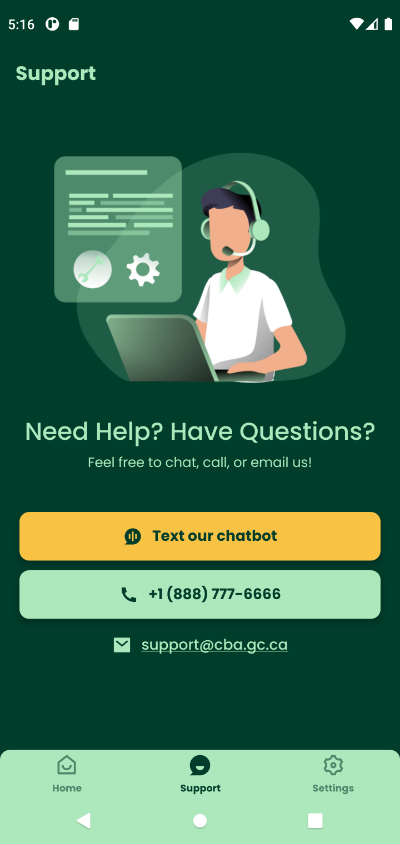
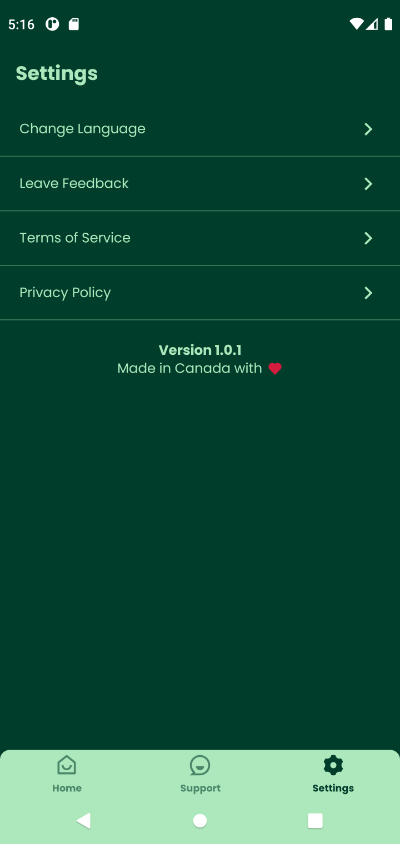

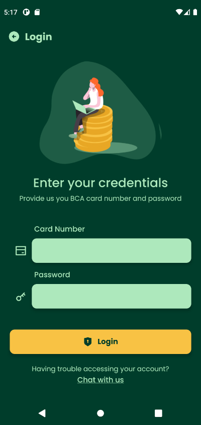
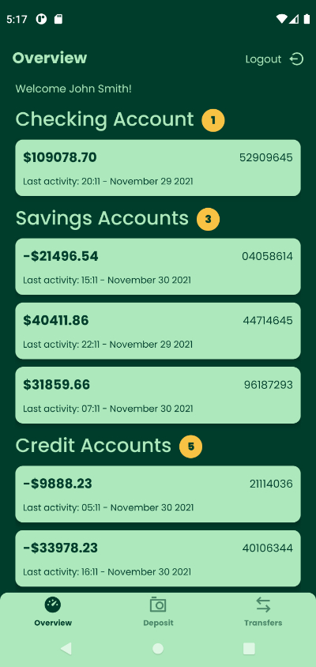
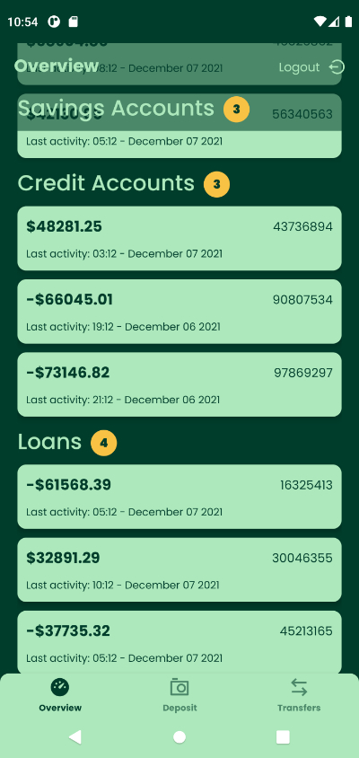
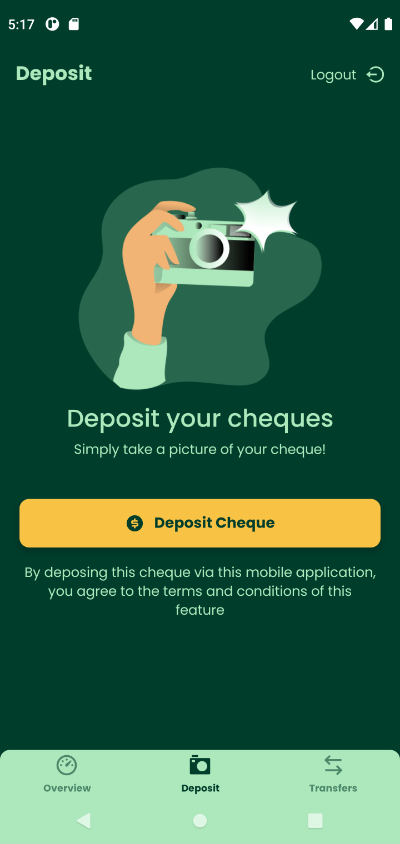
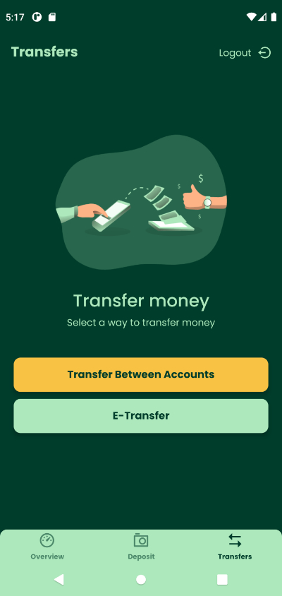
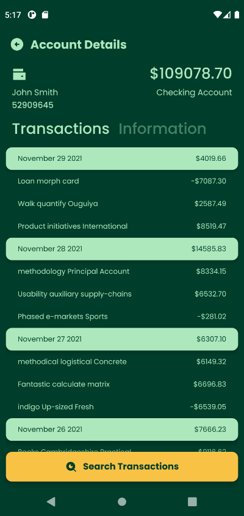
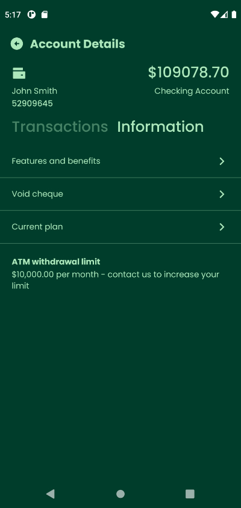
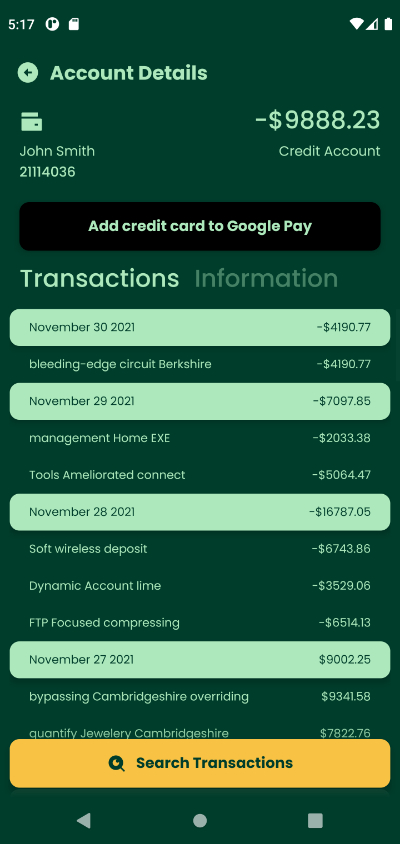
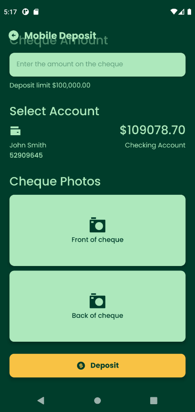
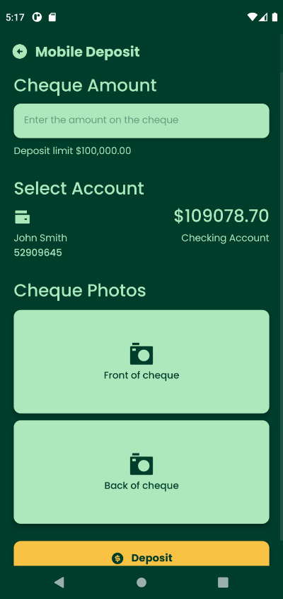
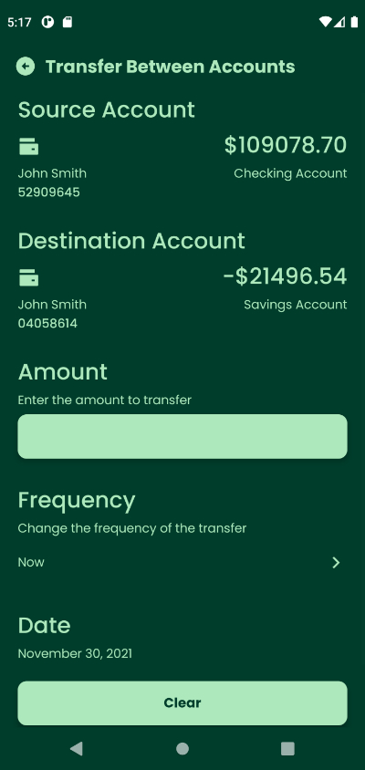
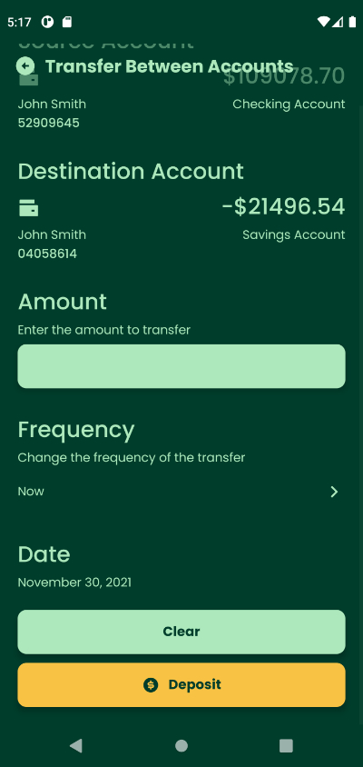
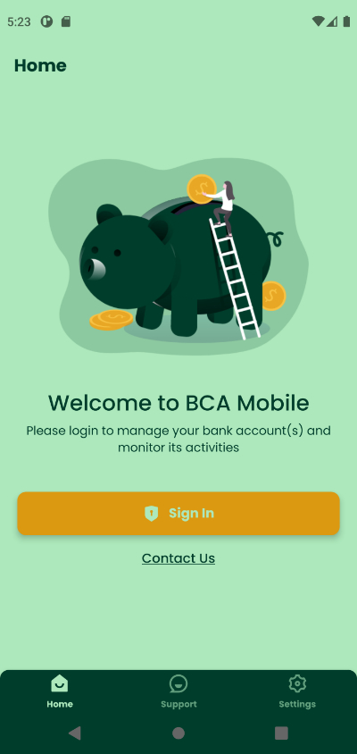